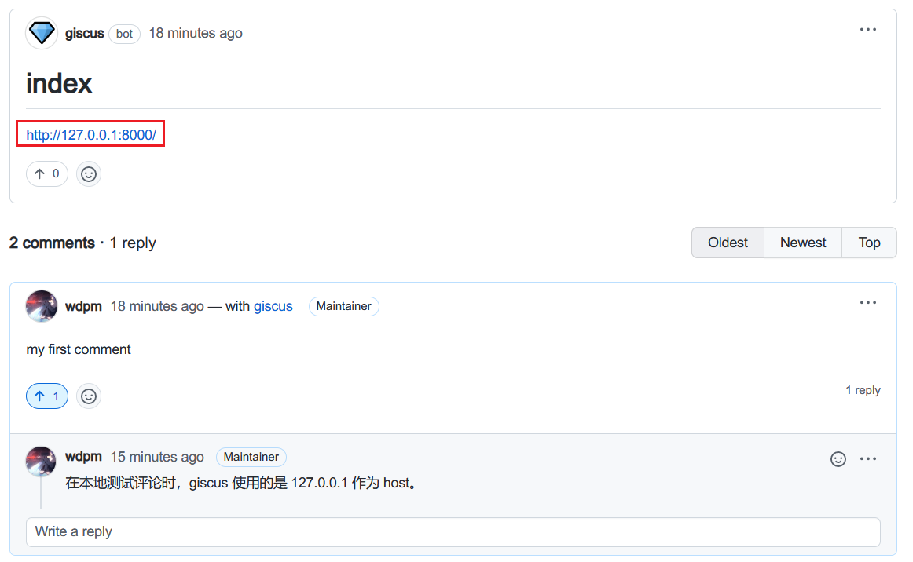

# customization

## 小调整

简单起见，对于 CSS 和 JS 文件，可以直接在 docs 目录下添加

```
.
├─ docs/
│  └─ stylesheets/
│     └─ extra.css
│  └─ javascripts/
│     └─ extra.js
└─ mkdocs.yml
```

```yaml
extra_css:
  - stylesheets/extra.css

extra_javascript:
  - javascripts/extra.js
```

## 大调整

在配置中添加个性化的目录，这里是 `overrides`, 它位于根目录下。

```yaml
theme:
  name: material
  custom_dir: overrides
```

overrides 目录中的结构必须反映原始主题的目录结构， 因为 overrides 目录中的任何文件都将替换作为原始主题一部分的同名文件。 此外，还可以将更多资产放在 overrides 目录中：

```
.
├─ .icons/                             # Bundled icon sets
├─ assets/
│  ├─ images/                          # Images and icons
│  ├─ javascripts/                     # JavaScript files
│  └─ stylesheets/                     # Style sheets
├─ partials/
│  ├─ integrations/                    # Third-party integrations
│  │  ├─ analytics/                    # Analytics integrations
│  │  └─ analytics.html                # Analytics setup
│  ├─ languages/                       # Translation languages
│  ├─ actions.html                     # Actions
│  ├─ comments.html                    # Comment system (empty by default)
│  ├─ consent.html                     # Consent
│  ├─ content.html                     # Page content
│  ├─ copyright.html                   # Copyright and theme information
│  ├─ feedback.html                    # Was this page helpful?
│  ├─ footer.html                      # Footer bar
│  ├─ header.html                      # Header bar
│  ├─ icons.html                       # Custom icons
│  ├─ language.html                    # Translation setup
│  ├─ logo.html                        # Logo in header and sidebar
│  ├─ nav.html                         # Main navigation
│  ├─ nav-item.html                    # Main navigation item
│  ├─ pagination.html                  # Pagination (used for blog)
│  ├─ palette.html                     # Color palette
│  ├─ post.html                        # Blog post excerpt
│  ├─ search.html                      # Search interface
│  ├─ social.html                      # Social links
│  ├─ source.html                      # Repository information
│  ├─ source-file.html                 # Source file information
│  ├─ tabs.html                        # Tabs navigation
│  ├─ tabs-item.html                   # Tabs navigation item
│  ├─ tags.html                        # Tags
│  ├─ toc.html                         # Table of contents
│  └─ toc-item.html                    # Table of contents item
├─ 404.html                            # 404 error page
├─ base.html                           # Base template
├─ blog.html                           # Blog index page
├─ blog-archive.html                   # Blog archive index page
├─ blog-category.html                  # Blog category index page
├─ blog-post.html                      # Blog post page
└─ main.html                           # Default page
```

下面是一些具体的例子。

### 重写 title

创建 `overrides/main.html`

```html



<title>Lorem ipsum dolor sit amet</title>

```

这里，仅重写了 htmltitle 这个块。

如果只是想嵌入式添加内容，那么请调用 super()

```html



<!-- Add scripts that need to run before here -->
{{super() }}
<!-- Add scripts that need to run afterwards here -->

```

关于 block， 参阅 [overriding-partials](https://squidfunk.github.io/mkdocs-material/customization/#overriding-partials)

### 重写 footer

创建 `overrides/partials/footer.html`

```html
<p>this is my custom footer</p>
```

### 引入 comment

新建 `overrides/partials/comments.html`，由于代码过长，具体请参阅该仓库源码。

注意：本地图片的相对路径是相对于当前 md 文件的。例如: ``

具体效果截图：



可以得知，在本地测试时，使用的是 127.0.0.1 作为路径前缀，这样的话，线上和本地测试的评论就不会冲突。很好。